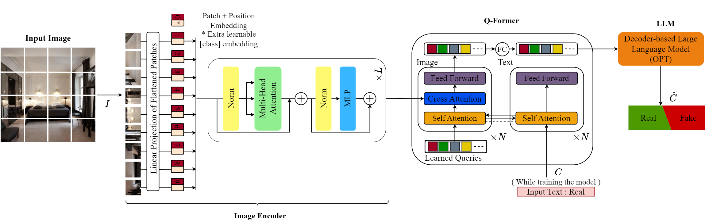

# Harnessing the Power of Large Vision Language Models for Synthetic Image Detection

This is the **official repository** for the [**paper**](https://arxiv.org/abs/) "*Harnessing the Power of Large Vision Language Models for Synthetic Image Detection*".



## Requirements
``` python
pip install -r requirements.txt
```

## Training (Optional)
This step can be skipped, and you can directly test the model in the following section with a pre-trained model.

To train your own model:
```python
python blip2_detect.py --dataset ./data/train.csv --epochs 20 --lr 5e-5 
```
## Evaluation
To run the evaluation, use the following command:
```python
python blip2_test.py --model_path ./SaveFineTune --dataset ./data/test.csv
```
## Performance
After training for 20 epochs, you will obtain accuracy and F1-score scores close to the percentages below:

```python
{'LDM' : 99.12/99.13, 'ADM' : 85.24/82.97, 'DDPM' : 98.47/98.47, 'IDDPM' : 97.02/96.97, 'PNDM' : 99.22/99.23, 'SD v1.4' 77.68/71.79: , 'GLIDE' : 97.09/97.05} 
```

## :book: Citation
if you make use of our work, please cite our paper
```
@{

}
```
